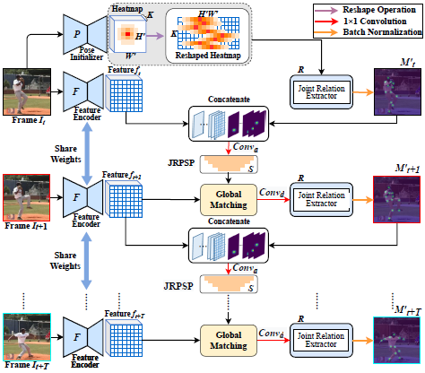
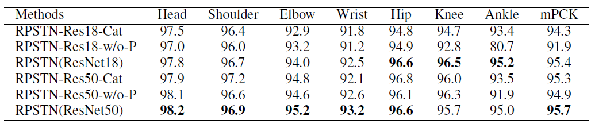
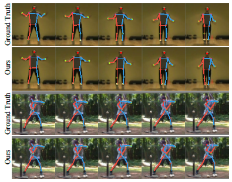

# Relation-Based Associative Joint Location for Human Pose Estimation in Videos

## Introduction
This is the implementation of [Relation-Based Associative Joint Location for Human Pose Estimation in Videos](https://arxiv.org/abs/2107.03591). In this work, we are interested in the video-based human pose estimation with a novel relation-based associative joint location. Most existing methods produce the heatmap for each joint independently, damaging the structural information of poses. Instead, our proposed Relation-based Pose Semantics Transfer Network (RPSTN) can generate heatmaps for all joints by modeling the relationship between any two joints. Moreover, considering the temporal semantic consistency of videos, the proposed RPSTN adopts a global matching mechanism to propogate semantic features of poses from the current frame to the next, which helps model capture the temporal dynamics of poses. As a result, the predicted jonit heatmap is potentially more accurate and spatially more precise. We demonstrate the effectiveness of our method on two challenging datasets: the Penn Action dataset and the Sub-JHMDB dataset.

 

<caption>Fig.1. The overview of our proposed RPSTN.</caption>

<!--  -->

## Dataset
You can download three datasets from links below.

MPII dataset: [http://human-pose.mpi-inf.mpg.de/](http://human-pose.mpi-inf.mpg.de/)

Penn Action dataset: [http://dreamdragon.github.io/PennAction/](http://dreamdragon.github.io/PennAction/)

Sub-JHMDB dataset: [http://jhmdb.is.tue.mpg.de/challenge/JHMDB](http://jhmdb.is.tue.mpg.de/challenge/JHMDB)

## Pre-trained Models
Pre-trained models can be obtained: [models](https://pan.baidu.com/s/122N3gqu5-NcyAbF5NM47CA)

Fetch code: g76i

## Main Results
**Results on Penn Action dataset**

 

 

## Environment

Thanks for the implementation of [Simple Baselines for Human Pose Estimation and Tracking](https://github.com/Microsoft/human-pose-estimation.pytorch) and [UniPose: Unified Human Pose Estimation in Single Images and Videos](https://github.com/bmartacho/UniPose).

The code is developed using python 3.6 on Ubuntu 16.04. NVIDIA GPUs are needed. The code is developed and tested using 2 NVIDIA 1080Ti GPU cards. Other platforms or GPU cards are not fully tested. You can install required packages following [Simple Baselines for Human Pose Estimation and Tracking](https://github.com/Microsoft/human-pose-estimation.pytorch).

## Train & Test

1. You can train the model following:

`python pose_estimation/1_train_penn.py --is_train True --visual False`

2. You can test the model following:

`python pose_estimation/1_train_penn.py` 

## Citation
If you use our code or models in your research, please cite with:

	@article{dang2021relationbased,
      title={Relation-Based Associative Joint Location for Human Pose Estimation in Videos}, 
      author={Yonghao Dang and Jianqin Yin and Shaojie Zhang},
      year={2022},
      journal   = {{IEEE} Trans. Image Process.},
      volume    = {31},
      pages     = {3973--3986},
	}
